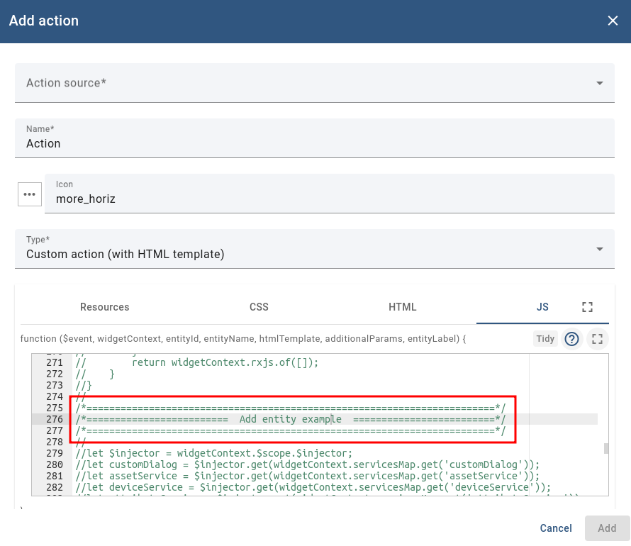
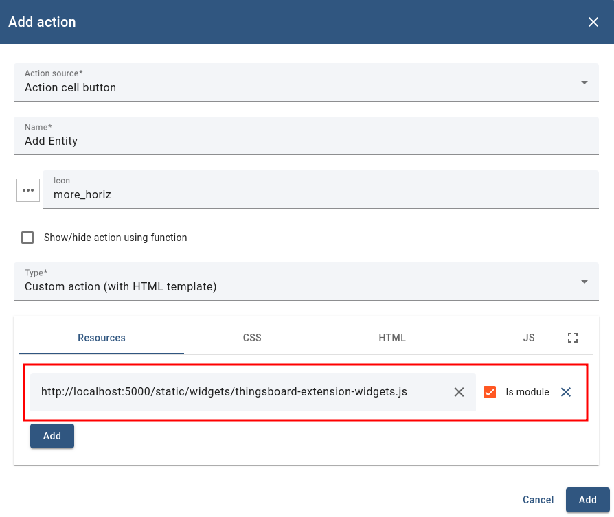
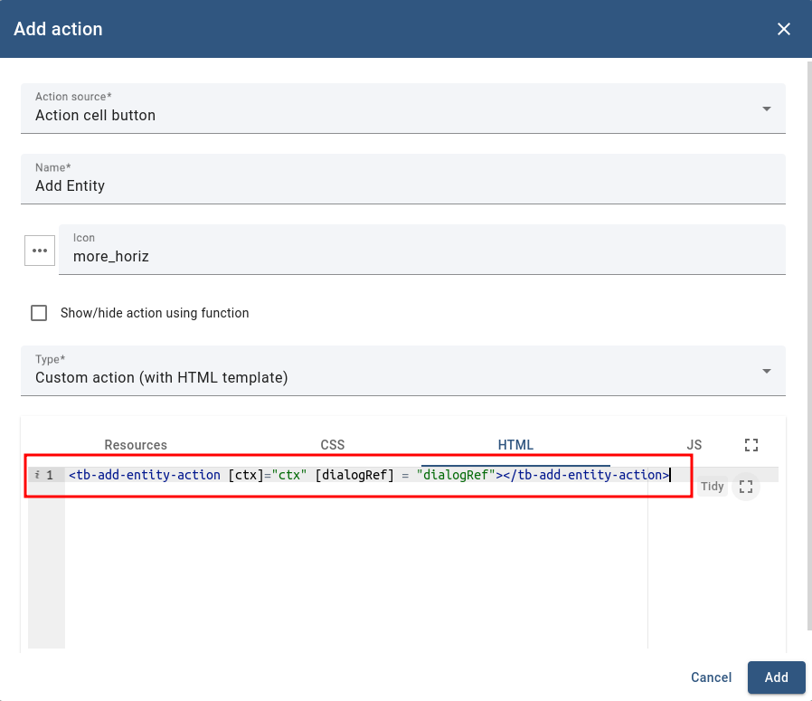
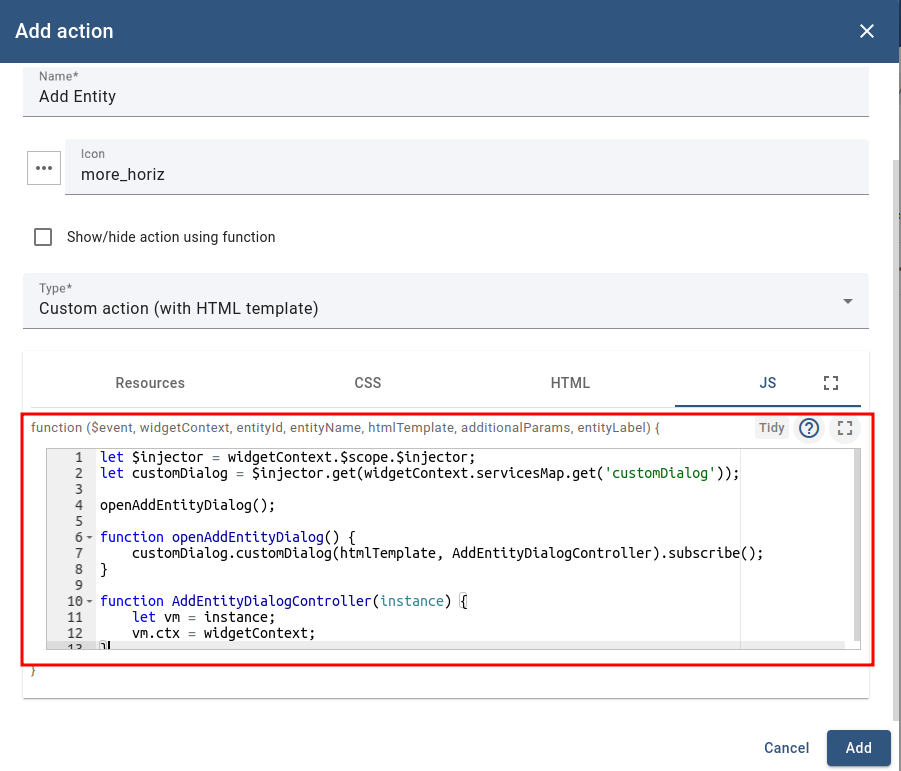
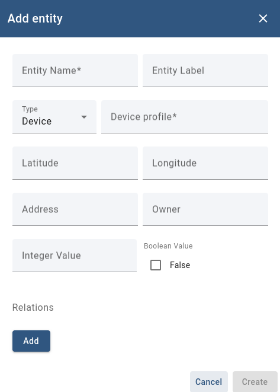

# Action Example

You can find the code base [here](../../src/app/components/examples/example-action).

ThingsBoard platform supports actions that have been created in the widget extension.

This example adds an entity to the table using a custom action with an HTML template:



To add a custom action from widget extensions, you need to follow these steps:

1. Create a "Custom action (with HTML template)" and in the Resources tab of the action editor, enter your resource file name (you can find information on how to add a resource file into the system [here](https://thingsboard.io/docs/user-guide/contribution/ui/advanced-development/)).
   For this example, we run extensions in development mode, so we will use the development path to get our resources:

   ```
   http://localhost:5000/static/widgets/thingsboard-extension-widgets.js
   ```

   

2. Call the component in the HTML tab. The logic is completely the same as for any other Angular component:

   ```html
   <tb-add-entity-action [ctx]="ctx" [dialogRef]="dialogRef"></tb-add-entity-action>
   ```

   

3. Add JS code that will open an action window and prepare `ctx` and `dialogRef` for the component's inputs:

   ```javascript
   let $injector = widgetContext.$scope.$injector;
   let customDialog = $injector.get(widgetContext.servicesMap.get('customDialog'));

   openAddEntityDialog();

   function openAddEntityDialog() {
       customDialog.customDialog(htmlTemplate, AddEntityDialogController).subscribe();
   }

   function AddEntityDialogController(instance) {
       let vm = instance;
       vm.ctx = widgetContext;
   }
   ```

   

After these steps, the action integration is complete:


