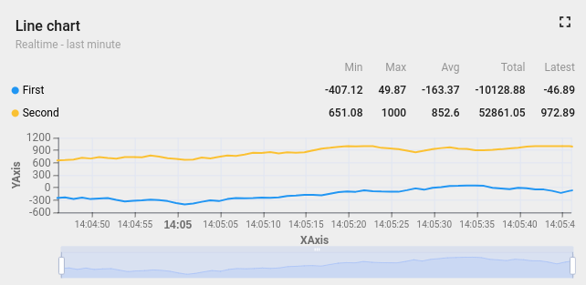

Custom widget example (EChart)
=====================
You can find code base [here](../../src/app/components/examples/example-chart).

This widget provides an example of using [EChart](https://echarts.apache.org/en/index.html) library. It is a simplified version of the default Thingsboard line chart widget.




If you are looking for instructions on how to create a custom widget you should read  ```README``` file in ```example-table``` directory.

