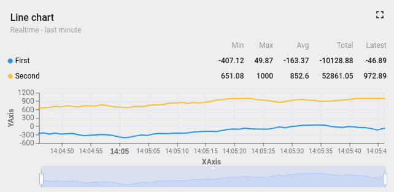

# Custom Widget Example (EChart)

You can find the code base [here](../../src/app/components/examples/example-chart).

This widget provides an example of using the [EChart](https://echarts.apache.org/en/index.html) library. It is a simplified version of the default ThingsBoard line chart widget.

If you are looking for instructions on how to create a custom widget, you should read the `README` file in the [example-table](../example-table) directory.
