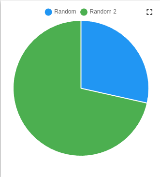
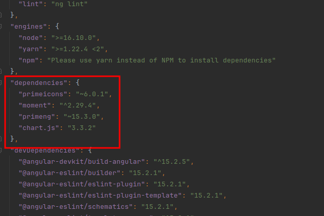

Custom widget example (chart from third-party library)
=====================
You can find code base [here](../../src/examples/example-of-using-third-party-library).

This widget demonstrates the ability to use any third-party library in your widget development.
This widget uses ```<p-chart>``` from [primeng](https://primeng.org):



You can find all dependencies in the ```package.json``` file at the root level of project:



If you are looking for instructions on how to create a custom widget you should read  ```README``` file in ```example-table``` directory.

