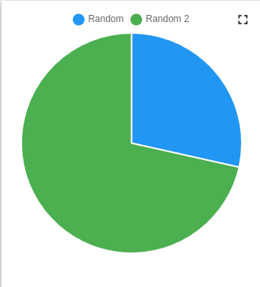
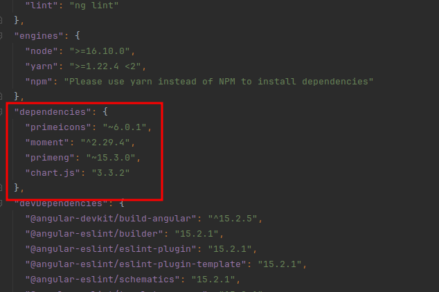

# Custom Widget Example (Chart from Third-Party Library)

You can find the code base [here](../../src/app/components/examples/example-of-using-third-party-library).

This widget demonstrates the ability to use any third-party library in your widget development.
This widget uses `<p-chart>` from [PrimeNG](https://primeng.org):

You can find all dependencies in the `package.json` file at the root level of the project:

If you are looking for instructions on how to create a custom widget, you should read the `README` file in the [example-table](../example-table) directory.
