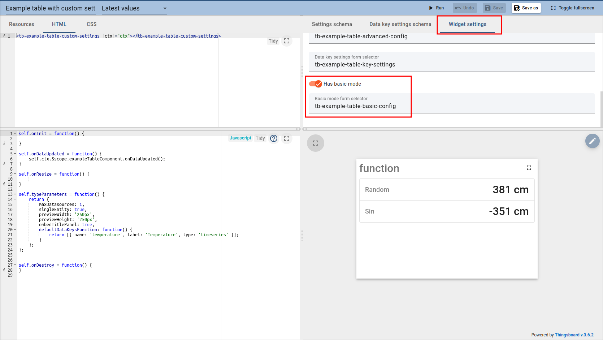
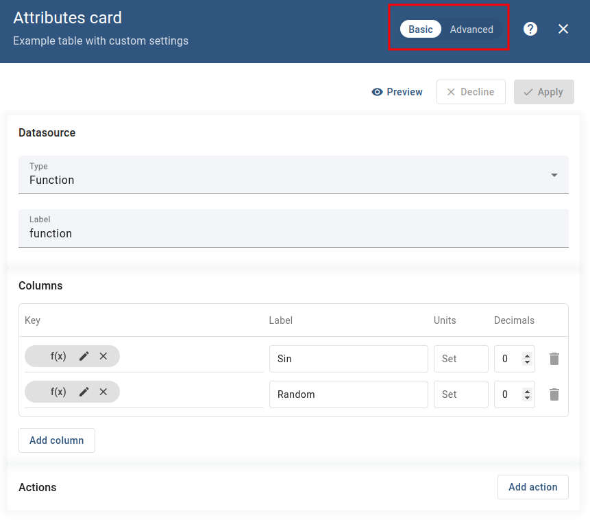
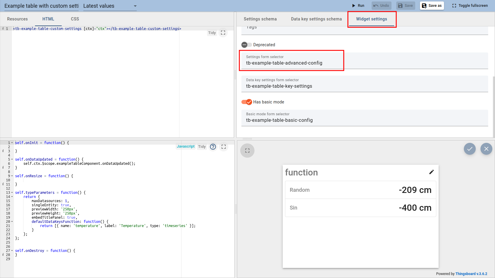
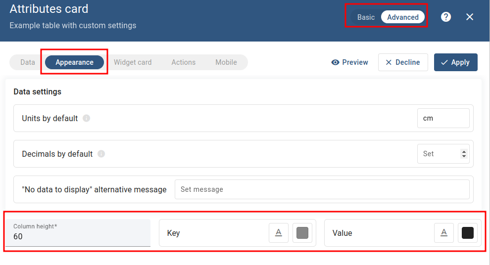
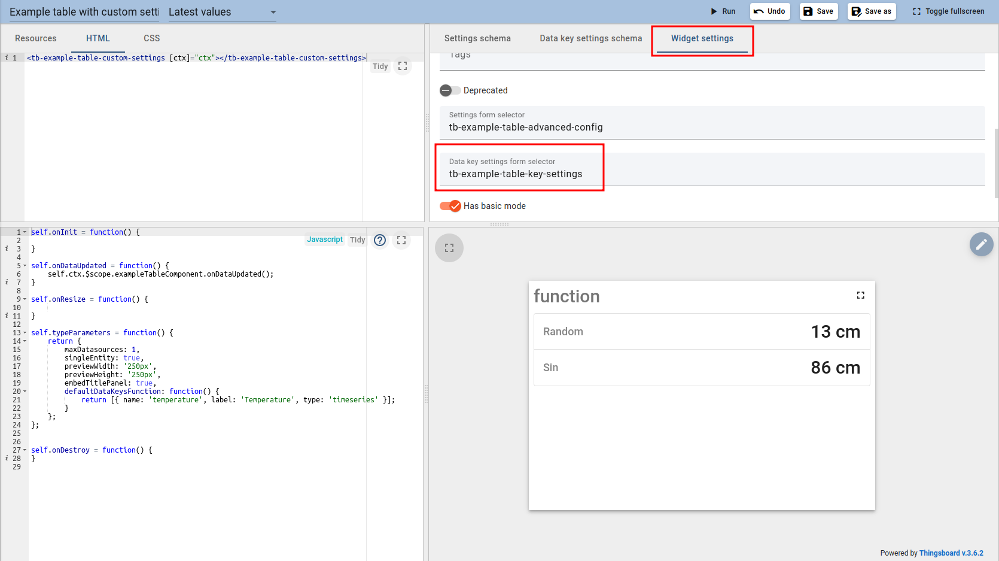
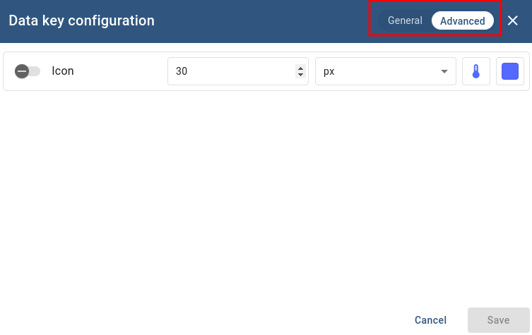

Custom widget example (table wight custom settings)
=====================

You can find code base [here](../../src/examples/example-table-with-custom-settings).

The main purpose of this example is to show you the custom settings feature. In the scope of this example, we will skip the steps of creating widgets and immediately start working with custom settings. 
If you want to read about base widget-creating logic you should read the ```README``` file inside the ```example-table``` directory.

So, let's take a look at the custom widget:


As you can see, this widget is just a table with some sort of customization. Namely, the ability to select icon and its style for each key, the ability to select color, font, and other styles for the key, and value.

For this logic, we will use all customer settings tabs that ThingsBoard supports:
- Advanced config - contains general widget settings. In our case, it's styles for the key and value.
- Data key setting - contains parameters that are configured separately for each key. In our case, it's icon selection.
- Basic config - is used to show only basic configuration settings like datasources, actions, etc. It makes the interface more understandable for new users. In our case, we will add the datasource, columns, and actions to the basic config. All other settings will only be available in the advanced settings for "power-users".
  
**Important remark! The advanced config should contain all settings from the basic config.**

So let's start with the basic config. You can find the code in the basic-config directory ```basic-config```.
In general, the code for any configuration is just another Angular component.

To add basic config you should open the corresponding widget settings tab. Then tick the ```Has basic mode``` slider and enter the selector of your component in field ```Basic mode from example```:



Pay attention, the basic config can be disabled using ```Has basic mode``` slider. In this case, user can use only advanced setting config.

If you've done everything correctly, the widget will have two tabs in the top right corner in edit mode: ```Basic/Advanced```.



Now let's connect the advanced config (its code is in the ```advanced-config``` directory). To do this, you should enter the component's selector in the same widget settings tab in ```Settong form selector``` field:



These settings will be added to the advanced section of edit mode, inside appearance tab.  Pay attention that ```Data settings```  inputs are not circled. This is because they are part of the default widget functionality and will be displayed even if you don't add any custom advanced config: 



Finally, let's connect the data key settings to be able to select icons (Code is in the ```data-key-settings``` directory). To do this, you should enter the component's selector in the same widget-settings tab in  ```Data key settings form selector``` field:



You can find custom key settings in Advanced tab of key configuration:



General tab of data key configuration contains default key settings. They will be displayed even you don't add custom component:


This covers all of the various custom settings available in ThingsBoard. By using these three types, you can create versatile configuration for most of the cases that you may encounter.

