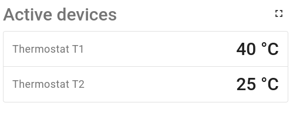

# Custom Widget Example (Table with Custom Subscription)

You can find the code base [here](../../src/app/components/examples/example-table-with-custom-subscription).

This widget shows the temperature key for all active devices:

For this task, it uses the custom subscription feature.
In general, it allows you to obtain data based on your custom rules, which is not possible with the default functionality. You can read more about it in the [documentation](https://thingsboard.io/docs/pe/user-guide/contribution/widgets-development/#custom-subscriptions).

If you are looking for instructions on creating a custom widget, you should read the `README` file in the [example-table](../example-table) directory.
