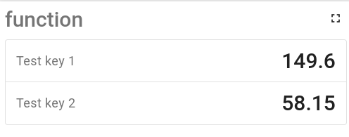
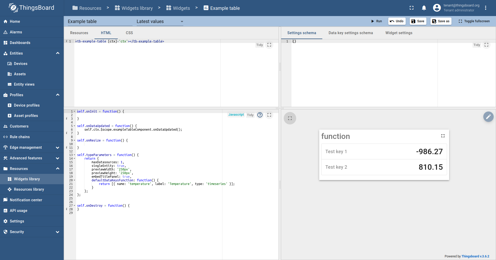

Custom widget example (table)
=====================

You can find code base [here](../../src/app/components/examples/example-table).

The main purpose of this example is to show you the basic logic of creating custom widgets.
For this, we will use the simple custom table that shows the list of key-value pairs:



First of all, note the file ```example_table.json```. It's a fully configured widget intended for launching in development mode.
All you need to do is run extensions in development mode and import this file to the ThingsBoard widget library.

After that you can open custom widget in widget library:



Let's consider the main parts of any custom widget:

- Resources. In the resource tab, you should add your resource file(you can find information on how to add resource file into system [here](https://thingsboard.io/docs/user-guide/contribution/widgets-development/#thingsBoard-extensions)).
As this widget has been configured for the development mode, the path to development resources has been entered in the resource field:

```html
http://localhost:5000/static/widgets/thingsboard-extension-widgets.js
```


- HTML. In the HTML tab, the custom component is called within the HTML section. Logic is completely the same as for any other Angular component. In the JS section, you can control the behavior of your widget.
  In this example, a call to ```onDataUpdated()```  has been added when the widget receives new data. Additionally,
  ```typeParameters``` have been configured to control basic widget logic, such as the number of available datasources or the default datasource key


In general, to run custom widget you should specify the resource files, call your custom component in HTML section and add configuration, data update, and other additional logic in JS section.
