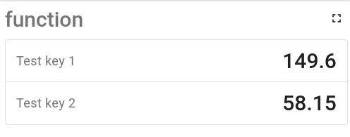
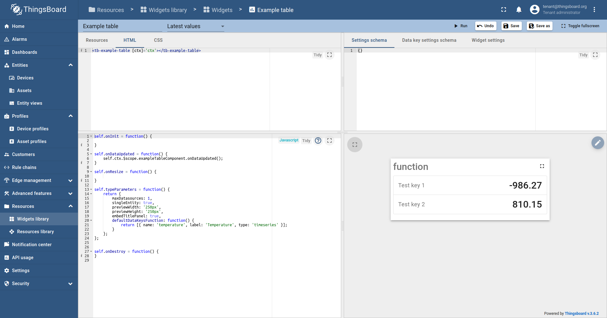
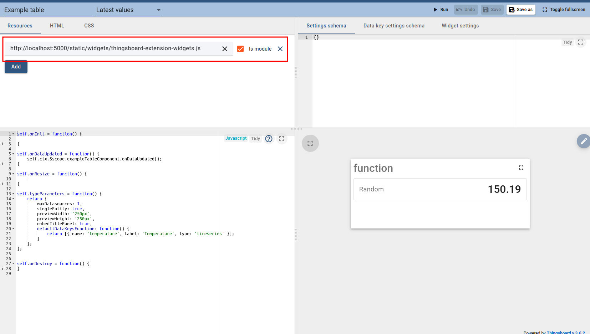
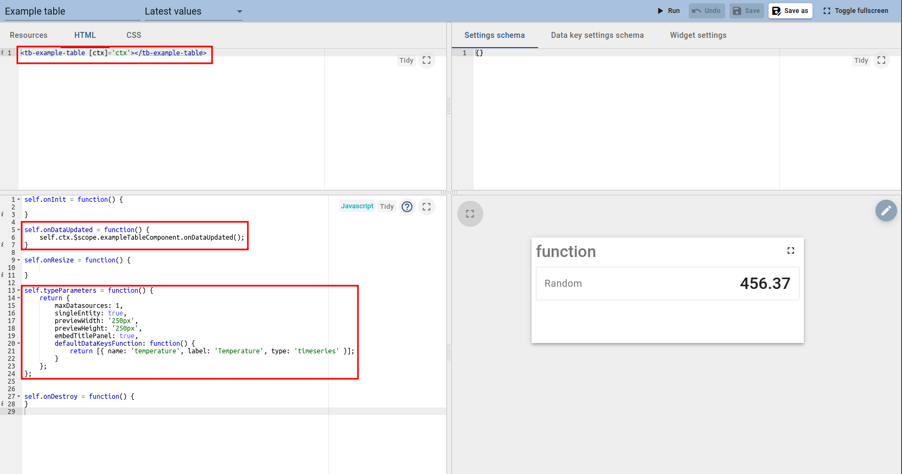

# Custom Widget Example (Table)

You can find the code base [here](../../src/app/components/examples/example-table).

The main purpose of this example is to show you the basic logic of creating custom widgets.
For this, we will use a simple custom table that shows a list of key-value pairs:



First of all, note the file `example_table.json`. It's a fully configured widget intended for launching in development mode.
All you need to do is run extensions in development mode and import this file to the ThingsBoard widget library.

After that, you can open the custom widget in the widget library:



Let's consider the main parts of any custom widget:

- **Resources.** In the Resources tab, you should add your resource file (you can find information on how to add a resource file into the system [here](https://thingsboard.io/docs/user-guide/contribution/ui/advanced-development/)).
  As this widget has been configured for development mode, the path to development resources has been entered in the resource field:

  ```
  http://localhost:5000/static/widgets/thingsboard-extension-widgets.js
  ```

  

- **HTML.** In the HTML tab, the custom component is called within the HTML section. The logic is completely the same as for any other Angular component. In the JS section, you can control the behavior of your widget.
  In this example, a call to `onDataUpdated()` has been added when the widget receives new data. Additionally, `typeParameters` have been configured to control basic widget logic, such as the number of available datasources or the default datasource key.

  

In general, to run a custom widget, you should specify the resource files, call your custom component in the HTML section, and add configuration, data update, and other additional logic in the JS section.
