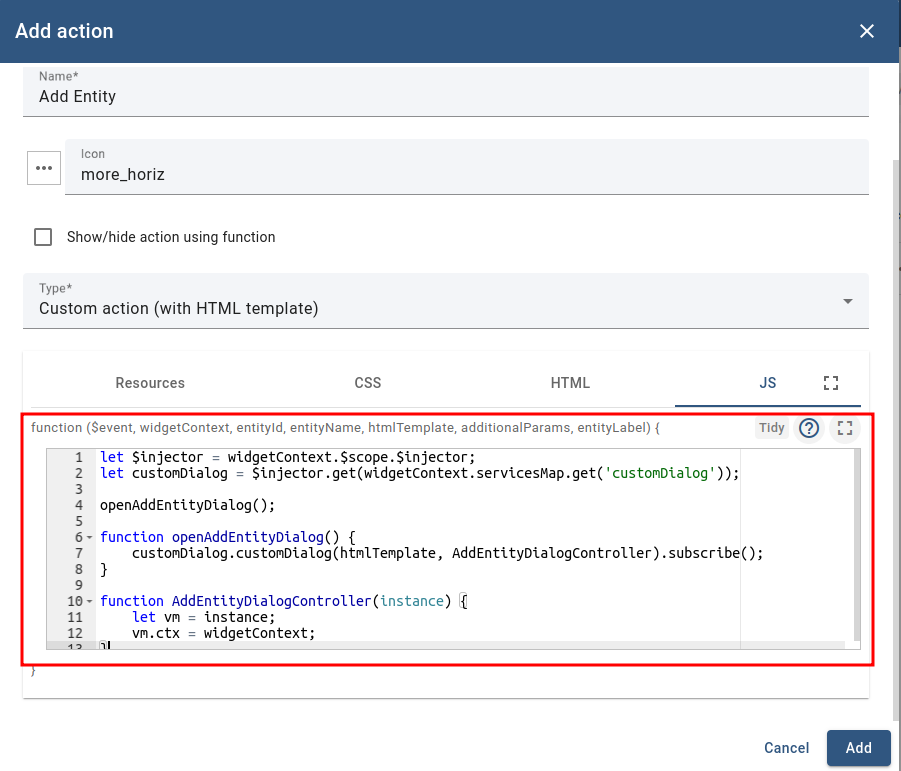

Action example
=====================

Thingsboard platform supports actions that have been created in the widget extension.

This example adds an entity to the table. The same logic you can find in Custom action (with HTML template):


To add custom action from widget extensions you need to do the next steps:

- Create 'Custom action (with HTML template)' and in the resources tab
of the action editor enter your resource file name(you can find information how to add resource file into system [here](https://thingsboard.io/docs/user-guide/contribution/widgets-development/#thingsBoard-extensions)).
  For this example we run extensions in development mode so we will use the development path to get our resources:
```
http://localhost:5000/static/widgets/thingsboard-extension-widgets.js
```


- Call our component on the HTML tab. Logic completely the same as for any other Angular component:
```html
<tb-add-entity-action [ctx]="ctx" [dialogRef] = "dialogRef"></tb-add-entity-action>
```


- Add JS code that will open an action window and prepare ```ctx``` and ```dialogRef``` for the component's Inputs:

```javascript
let $injector = widgetContext.$scope.$injector;
let customDialog = $injector.get(widgetContext.servicesMap.get('customDialog'));

openAddEntityDialog();

function openAddEntityDialog() {
    customDialog.customDialog(htmlTemplate, AddEntityDialogController).subscribe();
}

function AddEntityDialogController(instance) {
    let vm = instance;
    vm.ctx = widgetContext;
}
```



After these steps action integration is complete:


