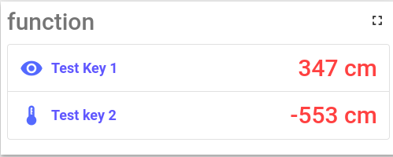

Custom widget example (table wight custom settings)
=====================

The main purpose of this example is to show you the custom settings feature. In the scope of this example, we will skip the steps of creating widgets and immediately start working with custom settings. 
If you want to read about base widget creating logic you should read ```README``` file inside ```example-table``` directory.

So let a look on custom widget:



As you can see this widget it's just a table with some sort of customization. Namely ability to select icon and its style for each key, the ability to select color, font, and other styles for the key, and value.

For this logic we will use all customer settings tabs that thingsboard support:
- Advanced config - contain general widget settings. In our case, it's styles for the key, and value.
- Data key setting - contains parameters that are configured separately for each key. In our case, it's icon selection.
- Basic config - using to show only basic configuration settings like datasources, actions, etc. It's make interface more understandable for new users. In our case, we will add to the basic config datasource, columns and actions. All other setting will be only in advanced settings for 'pro users'.
  
**Important remark! The advanced config should contain all settings from basic config.**

So let's start with the basic config. You can find code of them in directory ```basic-config```.
In general, the code of any configuration it's just another Angular component.

To add basic config you should open that widget settings tab. Than marked slider ```Has basic mode``` and enter selector of your component in field ```Basic mode from example```:


Pay attention that basic config could be disable using ```Has basic mode``` slider. In this case user can use only advanced setting config.

If you do everything correctly in edit mode widget will have two tabs: ```Basic/Advanced``` in top right corner:


Now let's connect the advanced config (it's code in the directory ```advanced-config```). For this in the same widget setting tab you should enter selector of your component in field ```Settong form selector```:


These settings will be added to the advanced edit, inside appearance tab: 


Pay attention that ```Data settings```  inputs are not circled. it's because they are part of default widget functional and will be show even you not add any custom advanced config.

Finally, let's connect the data key settings to be able to select icons (Code in directory ```data-key-settings```). For this, in all the same widget-setting tab you should enter component's selector in field ```Data key settings form selector```:


You can find custom key setting in Advanced tab of key configuration:


General tab of data key configuration containe default key settings. They will be show even you don't add custom component:


That's all about Thingsboard custom settings. Using this three types you can create variative configuration for most of the cases that you may need.

