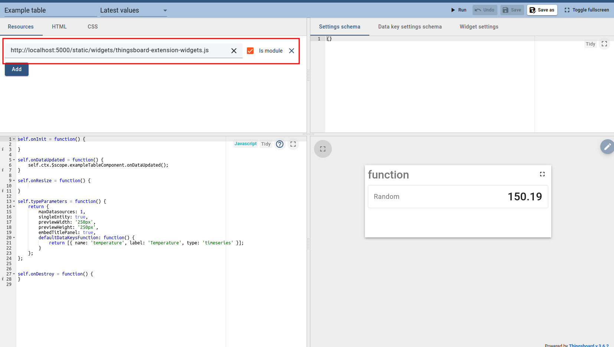

Custom widget example (table)
=====================

The main purpose of this example is to show you the basic logic of creating custom widgets.
For this we will use the simple custom table that shows the list of key-value:


First of all, note the file ```example_table.json```. It's a fully configured widget for launch in development mode.
All that you need to do it's run extensions in development mode and import this file to the thingsboard widget library.

After that you can open custom widget in widget library:


Let's consider the main parts of any custom widget:

- Resources. In the resource tab, you should add your resource file(you can find information how to add resource file into system [here](https://thingsboard.io/docs/user-guide/contribution/widgets-development/#thingsBoard-extensions)).
As this widget has been configured for the development mode, in resource field has entered path to the development resources:
```html
http://localhost:5000/static/widgets/thingsboard-extension-widgets.js
```



- HTML. In the HTML tab, in html section it has called custom component. Logic is completely the same as for any other Angular component. In the js section, you can control the behavior of your widget.
  In this example, has added call ```onDataUpdated()``` when the widget gets new data, and  has configured
  ```typeParameters``` that controls basic widget logic like the number of available datasources or default datasource key


In general, to run custom widget you should specify the resource files, call your custom component in html section and add configuration, data update, and other additional logic in JS section.
