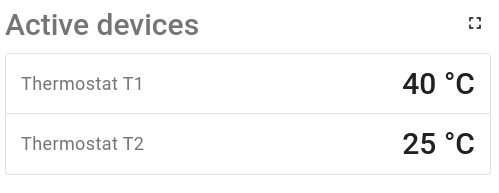

Custom widget example (table wight with custom subscription)
=====================

This widget shows the temperature key for all active devices:



For this task it use custom subscription feature.
In general, it allows you to get data by your custom rules that not possible in default functional. You can read more about it in our [documentation](https://thingsboard.io/docs/pe/user-guide/contribution/widgets-development/#custom-subscriptions)

If you looking for how to create a custom widget you should read  ```README``` file in ```example-table``` directory.
